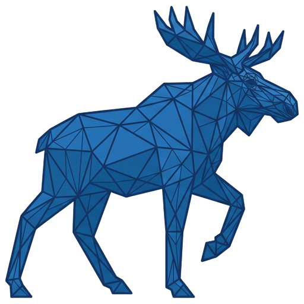

# MeshMoose.ai

<p align="center">
  
</p>

**From rough scans to editable CAD.**

Multimodal reconstruction for DIY makers: turn a **phone photo + quick scan** into parametric KCL, then refine it in plain language.

Built for the [Zoo API Makeathon](https://zoo.dev/events/api-makeathon) (July–August 2026).

## Why

DIY makers often start with a **phone photo** and a **quick mesh** (photogrammetry app, cheap scanner, or a downloaded STL). Neither input is enough on its own:

- **Photos** under-specify dimensions, hidden faces, and how parts fit together.
- **Meshes** are frozen triangles — fine to print or nudge as a blob, awkward to redesign as real CAD (change wall thickness, add clearance, swap a finish).

Remodeling the whole part by hand in traditional CAD is slow when the goal is “this stand, but thicker walls and a brushed finish.” MeshMoose targets that gap: you supply **photo + mesh + a plain-language prompt**, and Zoo’s Agent is asked to **recreate parametric KCL** that captures design intent — **not** to edit the imported mesh.

After reconstruction you can **trust the result** (Compare overlay, Align, deviation heatmap), preview in the **live Engine**, **Apply finish** without another Agent call, export **STL / STEP / 3MF**, and **iterate** with refine messages. Incomplete or noisy scans are first-class (see the `partial-stand` demo and `meshmoose mesh corrupt`). The same pipeline runs from the **browser UI**, local **HTTP API**, or **`meshmoose` CLI** — local-first jobs on disk, Zoo token only in the client.

## Zoo APIs used

| API | Role |
|-----|------|
| **Agent** (ML Copilot / Zookeeper) | Photo + mesh + prompt → editable `main.kcl`; refine continues the conversation |
| **Engine** (`zoo-kcl`; browser: `@kittycad/web-view` + `@kittycad/lib` WebRTC worker) | Execute KCL → export STL/STEP/3MF; optional live WebRTC preview + in-browser KCL editor |
| **File Format** | Volume / surface area / mass / center-of-mass (reference vs generated) |
| **Account** | Credits and recent billable calls in the **API key** menu / `meshmoose usage` |

## Quick start

Prerequisites: Python **3.11+**, Node **20+**, a [Zoo](https://zoo.dev) API token.

```bash
git clone https://github.com/KoraiD/MeshMoose.git
cd MeshMoose

python3 -m venv .venv
source .venv/bin/activate          # Windows: .venv\Scripts\activate
pip install -e "apps/api[dev]"     # installs API + `meshmoose` CLI

npm install                         # postinstall copies kcl-wasm @0.1.168 → apps/web/public/

cp .env.example .env.local         # optional; set ZOO_API_TOKEN=…
npm run dev                        # API :8787 + web :5173
```

On **Windows**, `npm run dev:api` / `npm run test:api` invoke `sh -c` — use Git Bash, WSL, or run `uvicorn` / `pytest` directly from an activated venv.

After `npm install`, **hard-refresh** the browser so Live Engine does not load a stale `kcl_wasm_lib_bg.wasm`. Keep `@kittycad/lib@4.3.12` and `@kittycad/kcl-wasm-lib@0.1.168` pinned together (root `overrides`).

- **UI:** http://127.0.0.1:5173 → **API key** → paste token → New job (or open **Docs** in the app)
- **API docs:** http://127.0.0.1:8787/docs  
- **CLI:** `meshmoose health` · `meshmoose demos list` · `meshmoose --help`
- **Repo:** https://github.com/KoraiD/MeshMoose

If `npm run dev` exits with `Address already in use`, free port **8787** and retry:

```bash
kill $(lsof -t -iTCP:8787 -sTCP:LISTEN) 2>/dev/null
npm run dev
```

## Features

- Local-first jobs: history, live SSE logs (with reconnect), cancel, delete, **retry** failed runs
- Job status stays fresh while the app is open (SSE + short poll while jobs are running)
- Job **rename** and up to **5 tags** from a shared tag library (Settings + job detail); sidebar / Jobs modal filter by name, ID, tag, state, time
- **API key** menu: Zoo token, usage credits / recent calls, optional **10‑minute auto-refresh** of usage while the app is open
- **Settings**: theme (light / dark / system), job finish notifications, tag library, custom refine snippets (text + optional photo/mesh attachments), prompt templates, app log (Diagnostics)
- Browser **notifications** when a job succeeds or fails (opt-in; useful for parallel runs)
- New-job modal: title, templates, agent mode (`thoughtful` / `fast` / `auto`; API/CLI also accept `zookeeper_pro`), multi photo + mesh, local STL preview, packaged demos
- **Photos:** JPG / PNG / WebP / GIF / HEIC / HEIF (HEIC→JPEG, GIF→PNG for Zoo)
- **Meshes:** STL / PLY / OBJ / 3MF / XYZ (normalized to STL for the Agent; XYZ → convex hull)
- Compare: side-by-side or **before/after opacity overlay**; selectable reference mesh; **Align tools** (Align / heatmap / Reset) + optional **manual nudge**; download STL / STEP / **3MF**
- Workbench: photos, filtered logs, assistant markdown, read-only KCL (current / diff vs initial), metrics (volume mm³ / cm³ / in³), **active time** (pipeline run time only)
- Iterate: prompt history, **KCL versions** (Restore archived edits; optional mesh re-export so Compare stays in sync), refine (text + optional photos/meshes or a saved snippet), **Apply finish** PBR presets (KCL `appearance`, no Agent call)
- Live Engine: WebRTC preview — zoom / pan / rotate / scale, camera views, edges / x-ray / explode, snaps, selection, multi-format export (beyond job artifacts); **KCL editor** below the viewport (edit draft, parse/lint squiggles, **Format**, **Run** without reconnect, **Save** with `kcl_history/` + optional mesh re-export); visiting the tab alone does **not** open a session — only **Start** (listed in the Jobs modal while connected)
- Engine export **retries** transient Zoo `EngineHangup` errors; job errors are sanitized for the UI
- Offline **`meshmoose mesh corrupt`** to simulate incomplete scans for demos/tests
- In-app **Documentation** + HTTP API + CLI

## Project layout

```
apps/api     FastAPI + Python client + meshmoose CLI
apps/web     React + Vite UI
demos/       Packaged fixtures (beverage-holder-stand, partial-stand, brick-wall, …)
docs/        Architecture, HTTP API, CLI, Zoo notes
scripts/     Smoke / validation helpers
```

## CLI (quick examples)

```bash
export ZOO_API_TOKEN=…             # or MESHMOOSE_TOKEN / .env.local

meshmoose health
meshmoose demos run beverage-holder-stand --mode fast --wait
meshmoose demos run brick-wall --mode fast --wait
meshmoose jobs create --prompt "Make a stand" --photo stand.jpg --mesh stand.stl \
  --title "Beverage stand" --tag stand --wait
meshmoose jobs finish <job_id> --preset brushed-aluminum --wait
meshmoose jobs save-kcl <job_id> --file ./main.kcl --reexport --wait
meshmoose jobs kcl-versions <job_id>
meshmoose jobs kcl-restore <job_id> <version_id> --reexport --wait
meshmoose jobs retry <failed_job_id> --wait
meshmoose jobs download <job_id> --out ./exports
meshmoose mesh corrupt demos/beverage-holder-stand/lidl-jar-stand.stl \
  -o /tmp/stand_partial.stl --missing 0.35 --noise 0.5
```

Full reference: [docs/cli.md](docs/cli.md) · HTTP: [docs/http-api.md](docs/http-api.md)

## Tests

```bash
npm test                 # vitest + pytest (no live Zoo required)
npm run test:api
npm run test:web
```

## Docs

- In-app: open **Docs** in the web UI
- [HTTP API](docs/http-api.md)
- [CLI](docs/cli.md)
- [Architecture](docs/architecture.md)
- [Zoo API notes](docs/api-notes.md)
- [Adding demos](demos/README.md)
- [Contributing](CONTRIBUTING.md)
- [Security](SECURITY.md)

## Security

- The API **never** persists your Zoo token; clients send `Authorization: Bearer` per request.
- Usage responses strip email, IP, and query strings.
- Do not commit `.env.local`, `data/`, or API keys.

## Acknowledgments / NOTICE

MeshMoose is an independent project built for the [Zoo API Makeathon](https://zoo.dev/events/api-makeathon). It uses [Zoo](https://zoo.dev) / KittyCAD public APIs and client libraries (Agent / ML Copilot, Engine, File Format, Account) under their terms of service. Zoo and KittyCAD are trademarks of their respective owners. This project is not affiliated with or endorsed by Zoo except as a Makeathon participant.

Bundled demo geometry for the beverage holder stand is the author’s own design published on [MakerWorld](https://makerworld.com/hu/models/111242-lidl-beverage-dispenser-stand-17-5-cm-bottom-diame).

## License

MIT — see [LICENSE](LICENSE).
