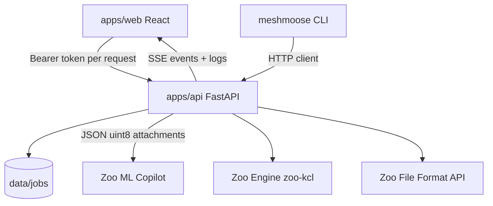

# Architecture



## Job lifecycle

`queued` → `preprocessing` → `agent_running` → `exporting` → `measuring` → `succeeded` | `failed`

- **Refine** re-enters at `agent_running` (message + current `main.kcl`, optionally new photos/meshes), then export + measure again.
- **Apply finish** rewrites KCL `appearance(...)` for a preset and re-enters at `exporting` (no Agent call).
- **Retry** clones a failed job’s prompt, title, tags, and input files into a new `queued` job (`retry_of` / `retried_as`).

Each step appends structured events to `events.jsonl` and a human `outputs/job.log`, streamed to the UI Logs panel. SSE stays open for the connection lifetime so refine / finish after success still update the Workbench.

On API process start, any job still marked in-flight is **reaped** as failed (daemon workers do not survive restart). Users can also **Cancel run** from the UI.

## Auth

The browser stores `meshmoose.zooApiToken` in **localStorage**. The API never persists the token; it only forwards `Authorization: Bearer` to Zoo for Agent / Engine / File / Account calls.

Authenticated job files (`/jobs/{id}/files/...`) require the same Bearer header. The mesh viewer fetches STLs with that header and builds blob URLs for Three.js.

## UI surfaces

| Surface | Purpose |
|---------|---------|
| Jobs list | Select, filter (name/ID/tag/state/time), retry failed, delete; **New job**; **Docs**; **Settings** |
| Settings | Token, theme, Zoo API usage, prompt templates (built-in + custom), app log |
| New job modal | Title, prompt templates, mode, photos, meshes, local STL preview, demos |
| Job detail | Rename / tags; Compare / Live engine / Workbench; prompt history; refine; Apply finish |
| Docs page | User guide, API/CLI summary |

## Storage

Per-job directory under `data/jobs/<id>/` (gitignored):

```
meta.json          title, tags[], prompts[], status, …
events.jsonl
inputs/            photos + meshes
outputs/           reference.stl, main.kcl, generated.stl/.step/.3mf, metrics.json, job.log, agent_*.jpeg
```

`meta.prompts[]` records the initial prompt, each refine message, and finish applications. Jobs without `prompts[]` are hydrated from `job.log` when loaded.

Volume in `metrics.json` is stored in **cm³**; the UI can display mm³ / cm³ / in³.

## Demos

`demos/<id>/demo.json` describes photos, meshes, and default prompt.  
`POST /jobs/from-demo/{id}` copies assets into a new job and starts the pipeline. See [../demos/README.md](../demos/README.md).

Bundled today:

| Id | Focus |
|----|--------|
| `beverage-holder-stand` | Full mesh + photos of a multi-part print |
| `partial-stand` | Same part with a corrupted “scan” mesh (`meshmoose mesh corrupt`) |

## Preprocess

| Input | Behavior |
|-------|----------|
| Photos JPG / PNG / WebP | Passed through (resized when large) |
| HEIC / HEIF | Converted to JPEG (`pillow-heif` or macOS `sips`) |
| GIF | Converted to PNG |
| STL | Copied as agent mesh / reference |
| PLY / OBJ / 3MF | trimesh load → STL (3MF is not Zoo-native) |
| XYZ / TXT | Convex hull → STL |

## Refine

Reopen ML Copilot with `conversation_id` when known, send refine text + `current_files["main.kcl"]`. Optionally multipart-upload new photos/meshes; meshes are preprocessed to STL, attached as `additional_files`, and can refresh `reference.stl`. Then re-export and re-measure.

## Apply finish

`POST /jobs/{id}/finish` with a preset id from `GET /finishes`. MeshMoose rewrites the existing `appearance(...)` assignment in `main.kcl` (or pipes onto the last solid assignment), appends a prompt-history entry, and re-exports. The Live Engine tab also applies parsed appearance params over WebRTC when connected.

## Live Engine preview

The web UI mounts `@kittycad/web-view` (`ZooWebView`) against the user’s Bearer token to WebRTC-stream the Zoo Engine executing `main.kcl`. After `ready`, MeshMoose sends modeling commands for zoom / pan / rotate / scale, camera presets, edge visibility, x-ray, explode, `export3d`, PNG snapshots, click selection, and touch gestures. Mesh compare (Three.js) remains the default offline view; live engine is opt-in (uses API minutes). WASM is copied to `apps/web/public/` via `npm postinstall` (`scripts/copy-wasm.mjs`).
