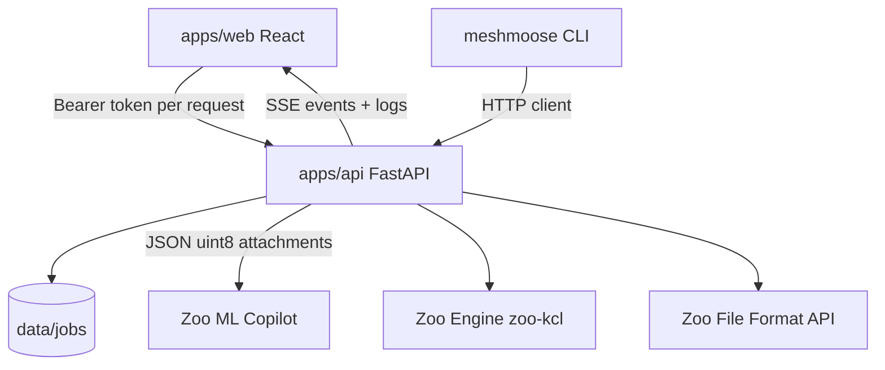

# Architecture



## Job lifecycle

`queued` → `preprocessing` → `agent_running` → `exporting` → `measuring` → `succeeded` | `failed`

- **Refine** re-enters at `agent_running` (message + current `main.kcl`, optionally new photos/meshes), then export + measure again.
- **Apply finish** rewrites KCL `appearance(...)` for a preset and re-enters at `exporting` (no Agent call).
- **Retry** clones a failed job’s prompt, title, tags, and input files into a new `queued` job (`retry_of` / `retried_as`).

Each step appends structured events to `events.jsonl` and a human `outputs/job.log`, streamed to the UI Logs panel. SSE stays open for the connection lifetime so refine / finish after success still update the Workbench. Clients may reconnect with `GET /jobs/{id}/events?after=N` to resume without replaying the full backlog. The web UI also **polls the jobs list** every few seconds while any job is running, so status, artifacts, and browser notifications still update if SSE drops (for example after an API reload).

`meta.active_ms` / `run_started_at` track **pipeline active time** (only periods in running statuses), which the UI shows as “Active time”.

Engine export (`zoo-kcl` `execute_code_and_export`) **retries** transient errors where `KclError.is_retryable()` is true (typical `EngineHangup` / connection interrupt). Failures stored on the job are passed through `format_job_error` so ANSI / tuple reprs from Zoo are readable in the UI.

On API process start, any job still marked in-flight is **reaped** as failed (daemon workers do not survive restart). Users can also **Cancel run** from the UI.

## Auth

The browser stores `meshmoose.zooApiToken` in **localStorage** (edited from the **API key** button). The API never persists the token; it only forwards `Authorization: Bearer` to Zoo for Agent / Engine / File / Account calls.

Authenticated job files (`/jobs/{id}/files/...`) require the same Bearer header. The mesh viewer fetches STLs with that header and builds blob URLs for Three.js.

## UI surfaces

| Surface | Purpose |
|---------|---------|
| Jobs list / Jobs modal | Select, filter (name/ID/tag/state/time), retry failed, delete; live Engine sessions; **New job**; **Docs**; **Settings** |
| API key menu | Token, Zoo usage (credits + recent calls), optional 10‑minute usage auto-refresh |
| Settings | Theme, job finish notifications, tag library, custom refine snippets, prompt templates, app log |
| New job modal | Title, prompt templates, mode, photos, meshes, local STL preview, demos |
| Job detail | Rename / tags; Compare / Live engine (preview + KCL editor) / Workbench / Iterate (prompt history, refine + snippets, Apply finish) |
| Docs page | User guide, API/CLI summary |

Browser-only libraries (localStorage / IndexedDB): tag vocabulary, refine snippets with attachments, usage auto-refresh preference, notification preference, theme.

## Storage

Per-job directory under `data/jobs/<id>/` (gitignored):

```
meta.json          title, tags[], prompts[], status, active_ms, run_started_at, …
events.jsonl
inputs/            photos + meshes
outputs/           reference.stl, main.kcl, main.initial.kcl, main.prev.kcl,
                   kcl_history/<id>.kcl + index.json (up to 20),
                   generated.stl/.step/.3mf, metrics.json, job.log, agent_*.jpeg
```

`meta.prompts[]` records the initial prompt, each refine message, finish applications, and manual KCL edits (`role: "edit"`). Jobs without `prompts[]` are hydrated from `job.log` when loaded.

Volume in `metrics.json` is stored in **cm³**; the UI can display mm³ / cm³ / in³.

## Demos

`demos/<id>/demo.json` describes photos, meshes, and default prompt.  
`POST /jobs/from-demo/{id}` copies assets into a new job and starts the pipeline. See [../demos/README.md](../demos/README.md).

Bundled today:

| Id | Focus |
|----|--------|
| `beverage-holder-stand` | Full mesh + photos of a multi-part print |
| `partial-stand` | Same part with a corrupted “scan” mesh (`meshmoose mesh corrupt`) |
| `brick-wall` | Compact running-bond brick segment (mesh + photo); also used as a refine texture package |

## Preprocess

| Input | Behavior |
|-------|----------|
| Photos JPG / PNG / WebP | Passed through (resized when large) |
| HEIC / HEIF | Converted to JPEG (`pillow-heif` or macOS `sips`) |
| GIF | Converted to PNG |
| STL | Copied as agent mesh / reference |
| PLY / OBJ / 3MF | trimesh load → STL (3MF is not Zoo-native) |
| XYZ / TXT | Convex hull → STL |

## Compare alignment

`POST /jobs/{id}/align` ICP-aligns `generated.stl` onto the active reference mesh and returns a transform plus per-vertex distances for the optional heatmap overlay. `GET` / `PUT /jobs/{id}/reference` select which input (or `outputs/reference.stl`) is the Compare reference.

## Refine

Reopen ML Copilot with `conversation_id` when known, send refine text + `current_files["main.kcl"]`. Optionally multipart-upload new photos/meshes; meshes are preprocessed to STL and attached as Agent guidance (`additional_files`). Refine does **not** overwrite `outputs/reference.stl` — Compare reference is chosen via `GET` / `PUT /jobs/{id}/reference`. Then re-export and re-measure.

The UI can attach a **custom refine snippet** (text + optional stored photos/meshes from IndexedDB) into the refine form.

## Apply finish

`POST /jobs/{id}/finish` with a preset id from `GET /finishes`. MeshMoose rewrites the existing `appearance(...)` assignment in `main.kcl` (or pipes onto the last solid assignment), appends a prompt-history entry, and re-exports. The Live Engine tab also applies parsed appearance params over WebRTC when connected.

## Live Engine preview + KCL editor

The web UI mounts `@kittycad/web-view` (`ZooWebView`) against the user’s Bearer token to WebRTC-stream the Zoo Engine executing KCL. After `ready`, MeshMoose sends modeling commands for zoom / pan / rotate / scale, camera presets, edge visibility, x-ray, explode, `export3d`, PNG snapshots, click selection, and touch gestures. Mesh compare (Three.js) remains the default offline view; live engine is opt-in (uses API minutes). Open sessions are registered in-memory **after Start** so the Jobs modal can stop them. WASM is copied to `apps/web/public/` via `npm postinstall` (`scripts/copy-wasm.mjs`).

The Live Engine tab includes a CodeMirror **KCL editor** stacked below the WebRTC viewport, editing a local draft of `main.kcl`:

- **Run** — `executor.submit(draft)` on the existing RTC session (no reconnect on each edit).
- **Save** — `PUT /jobs/{id}/kcl` writes `outputs/main.kcl`, archives the previous file into `outputs/kcl_history/`, updates `main.prev.kcl`, and appends a prompt-history `edit` entry. Optional **Also re-export meshes** queues STL/STEP/3MF + measure (same path as finish export).
- **Discard** — resets the draft to the committed file on disk.

The **Iterate** tab lists archived versions (`GET /jobs/{id}/kcl/versions`) with **Restore** (`POST /jobs/{id}/kcl/restore`) and an optional re-export checkbox. Workbench `main.kcl` stays read-only (committed view / diff).

## Manual KCL save / restore

- `PUT /jobs/{id}/kcl` — `{ "kcl", "note"?, "reexport"? }`
- `GET /jobs/{id}/kcl/versions` — newest-first archive list
- `POST /jobs/{id}/kcl/restore` — `{ "version_id", "note"?, "reexport"? }`

Rejected while the job is running. CLI: `meshmoose jobs save-kcl` / `kcl-versions` / `kcl-restore`.
